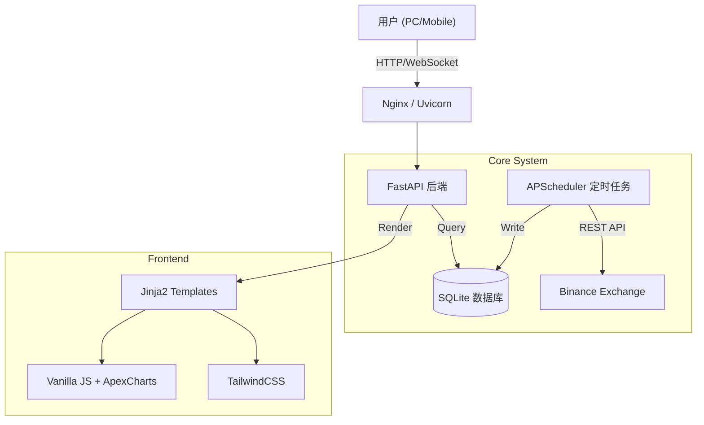

# 🚀 ZS's Crypto Shorting Cockpit (加密货币空头驾驶舱)


> **"Slow is Smooth, Smooth is Fast." (慢就是快)**
>
> 这是一个为量化交易者打造的、**移动端优先**的专业级加密货币交易分析与实时监控系统。它不仅仅是一个记账工具，更是一个集成了机构级风控标准、绩效归因分析和实时战场监控的完整解决方案。

---

## ✨ 核心功能特性

### 📊 1. 深度交易分析 (Analytics Dashboard)
超越交易所自带的基础报表，提供核心量化指标：
- **机构级绩效评估**: 自动计算 **夏普比率 (Sharpe)**、**卡玛比率 (Calmar)**、**索提诺比率 (Sortino)** 和 **系统质量数 (SQN)**。
- **资金管理辅助**: 内置 **凯利公式 (Kelly Criterion)** 建议，基于历史胜赔率动态推荐最佳仓位比例。
- **可视化报表**:
  - **权益曲线**: 精确的累计净值走势（已剔除充提币影响）。
  - **盈亏分布**: 散点图分析持仓时间与盈亏的关系（Duration Analysis）。
  - **时段分析**: 24小时盈亏热力图，识别最佳交易时段。
  - **红黑榜**: 自动统计各币种的胜率与贡献度。

### 📱 2. 实时战场监控 (Live Monitor)
专为多屏协同和移动办公设计的实时监控台：
- **秒级同步**: 并行数据加载架构，确保价格、持仓和账户余额毫秒级刷新。
- **移动端适配**: 独创的 **"Card View" (卡片视图)**，在手机端自动将宽表格转换为卡片，关键信息（uPnL, ROI, 持仓时长）一目了然。
- **全景风险视图**: 实时计算 **真实杠杆率 (Real Leverage)**、**风险敞口 (Exposure)** 和 **未结盈亏**。

### 🛡️ 3. 智能风控协议 (Risk Protocols)
系统内置自动化风控规则，时刻监控账户健康：
- **回撤熔断**: 实时监控当前回撤 (Drawdown)，配合账户健康度评分系统 (Health Score)。
- **僵尸仓位预警**: 自动标记持仓超过 **48小时** 的短线订单 (Stale Position)。
- **过夜风险提示**: 监控每日 23:00 后的持仓符号数量，防止过度分散。
- **连败保护**: 监控近期连续亏损笔数，触发“熔断”建议。

### ⚡ 4. 极致性能与体验
- **骨架屏加载 (Skeleton UI)**: 拒绝白屏和跳动，提供原生 App 般的流畅加载体验。
- **暗黑模式 (Dark Mode)**: 深度适配的 OLED 黑夜模式，不仅护眼，更是交易员的信仰。
- **本地化架构**: 核心数据存储于本地 SQLite，不依赖第三方云服务，数据绝对私有安全。

---

## 🛠️ 系统架构

本项目采用 **前后端分离** 的设计思想，基于 Python 生态构建：



- **后端**: FastAPI (高性能异步框架) + APScheduler (后台调度)
- **数据层**: Pandas (清洗计算) + SQLite (持久化存储)
- **前端**: 原生 JavaScript (无框架依赖) + Tailwind CSS + ApexCharts.js

---

## 🚀 快速开始

### 环境要求
- Python 3.10+
- 能够访问币安 API 的网络环境 (建议使用香港/日本节点)

### 1. 安装
```bash
# 克隆仓库
git clone <repository_url>
cd crypto_dashboard

# 创建虚拟环境
python3 -m venv venv
source venv/bin/activate  # Windows: venv\Scripts\activate

# 安装依赖
pip install -r requirements.txt
```

### 2. 配置
复制环境变量模板并填入您的 API Key：
```bash
touch .env
```

在 `.env` 文件中填入：
```ini
# 币安 API 凭证 (必须)
BINANCE_API_KEY=your_api_key_here
BINANCE_API_SECRET=your_api_secret_here

# 系统配置 (可选)
# 交易同步间隔 (分钟), 建议设为 1 以获得最佳实时性
UPDATE_INTERVAL_MINUTES=1
# 同步回溯天数
DAYS_TO_FETCH=90
```

### 3. 运行
```bash
# 启动开发服务器
uvicorn app.main:app --reload --host 0.0.0.0 --port 8000
```
访问 `http://localhost:8000` 即可看到仪表盘。

---

## 📂 项目结构

```
crypto_dashboard/
├── app/
│   ├── main.py            # FastAPI 入口与路由
│   ├── scheduler.py       # 后台数据同步调度器
│   ├── services.py        # 业务逻辑层
│   ├── models.py          # 数据模型定义
│   └── database.py        # 数据库连接管理
├── data/
│   └── trades.db          # SQLite 数据库文件 (自动生成)
├── templates/             # 前端页面
│   ├── index.html         # 主仪表盘 (Dashboard)
│   ├── live_monitor.html  # 实时监控 (Monitor)
│   ├── logs.html          # 系统日志
│   └── metrics.html       # 指标说明文档
├── static/                # 静态资源 (CSS/JS)
├── requirements.txt       # 项目依赖
└── trade_analyzer.py      # (Legacy) 独立分析脚本
```

---

## ⚠️ 免责声明

本软件仅供**教育和研究目的**使用。
- 加密货币交易具有极高风险，可能导致资金全额损失。
- 开发者不对因软件错误、API故障或网络延迟导致的任何资金损失负责。
- 请务必在实盘使用前充分测试。

---

## 📄 License

MIT License
