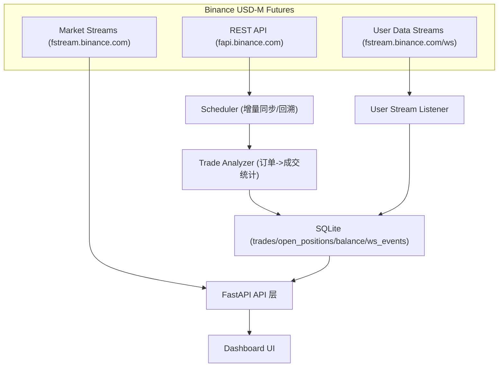

## 数据流重设计（Binance USD-M Futures）

目标：将“数据采集、处理、存储、展示”分层，减少重复拉取与耦合，并为 WebSocket 实时数据留出扩展点。

### 1) 数据源与通道
- REST API：用于历史回溯、定时增量同步、对账与纠错
- WebSocket User Data：用于账户/订单事件的实时增量
- WebSocket Market Streams：用于实时行情（标记价格、指数等）

### 2) 端到端数据流（新版）

### 3) 同步策略
- **首启/全量**：使用 REST 在 `START_DATE` 或 `DAYS_TO_FETCH` 范围内回溯
- **增量**：以数据库最近入场时间为基准，回溯 `SYNC_LOOKBACK_MINUTES` 形成“滑动窗口”同步
- **实时**：User Data Stream 持久化订单/账户事件，并补充余额轨迹
- **对账**：定时任务仍保留 REST 同步，保证 WS 丢包后的修正能力

### 4) 存储与职责
- `trades`：已平仓交易结果（分析产出）
- `open_positions`：未平仓入场单
- `balance_history`：账户余额/钱包余额时间序列
- `ws_events`：User Data Stream 事件原始记录（可用于审计与重算）

