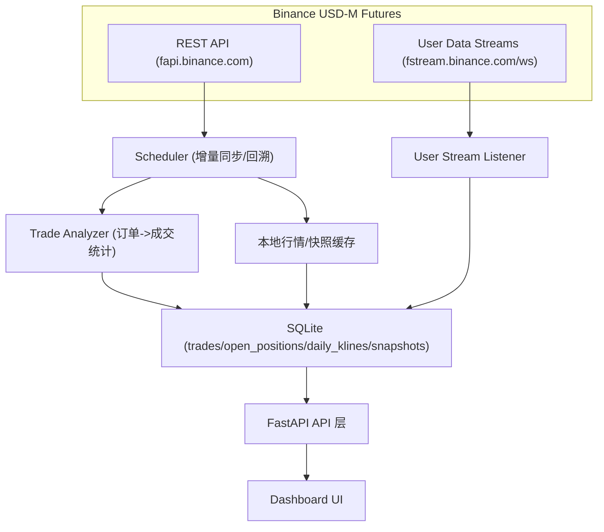

## 数据流重设计（Binance USD-M Futures）

目标：将“数据采集、处理、存储、展示”分层，减少重复拉取与耦合，并为 WebSocket 实时数据留出扩展点。

### 1) 数据源与通道
- REST API：用于历史回溯、定时增量同步、对账与纠错
- WebSocket User Data：用于账户/订单事件的实时增量
- WebSocket Market Streams：用于实时行情（标记价格、指数等）

### 2) 端到端数据流（新版）

```mermaid
graph TD
  subgraph "Binance USD-M Futures"
    REST["REST API (fapi.binance.com)"]
    WS_USER["User Data Streams (fstream.binance.com/ws)"]
  end

  Scheduler["Scheduler (增量同步/回溯)"]
  Analyzer["Trade Analyzer (订单->成交统计)"]
  UserStream["User Stream Listener"]
  DB["SQLite (trades/open_positions/daily_klines/snapshots)"]
  Cache["本地行情/快照缓存"]
  API["FastAPI API 层"]
  UI["Dashboard UI"]

  REST --> Scheduler
  Scheduler --> Analyzer
  Analyzer --> DB

  WS_USER --> UserStream
  UserStream --> DB

  Scheduler --> Cache
  Cache --> DB
  DB --> API --> UI
```

### 3) 同步策略
- **首启/全量**：默认每周日 03:30 校验最近 60 天，不再每天扫描；周任务使用固定回溯天数，不受手动回填用 `START_DATE` 影响
- **增量**：分别维护 income、每个 symbol 的 order/trade ID 与时间游标，保留 10～30 分钟重叠；只查询 income 判定出的近期活跃 symbol
- **日常校验**：每天 02:10 只校验最近 24～48 小时，并按 ID 去重
- **市场榜单**：06:15 更新本地 `daily_klines`，07:00 一次 ticker 后纯本地生成五组快照，07:30 仅读快照通知
- **页面读取**：API 只读 SQLite 和本地缓存；打开页面不会触发历史同步或 Binance 行情 REST 请求
- **实时**：User Data Stream 持久化订单/账户事件，并补充余额轨迹
- **对账**：定时任务仍保留 REST 同步，保证 WS 丢包后的修正能力

### 4) 存储与职责
- `trades`：已平仓交易结果（分析产出）
- `open_positions`：未平仓入场单
- `balance_history`：账户余额/钱包余额时间序列
- `ws_events`：User Data Stream 事件原始记录（可用于审计与重算）
- `daily_klines`：共享的日 K 线缓存，供涨跌幅榜、四组反弹榜及交易开盘价计算复用
- `sync_cursors`：income / orders / trades 的端点级增量游标
