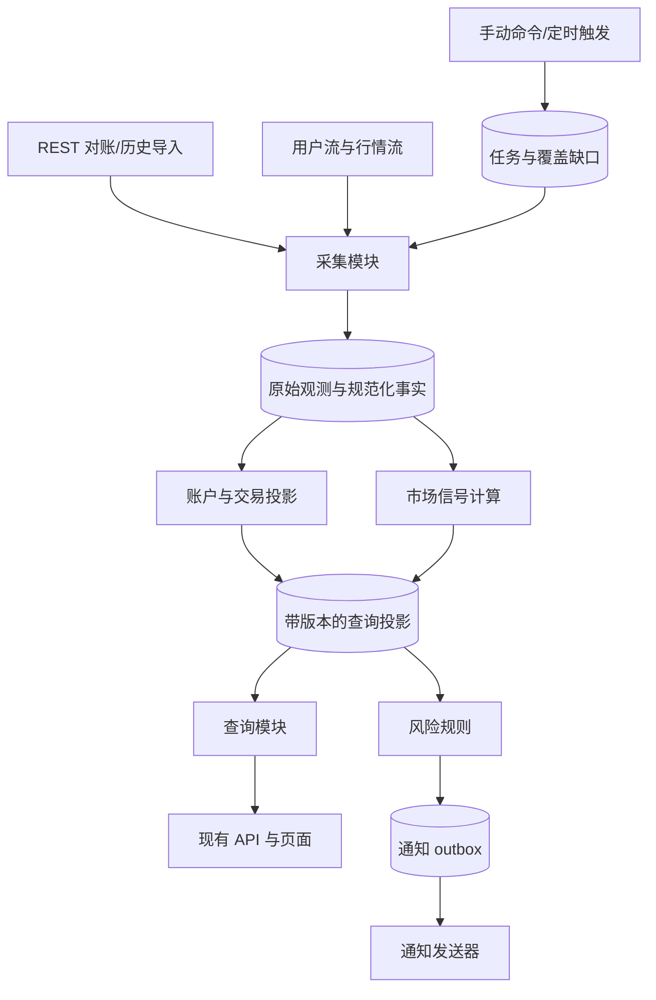

# 从第一性原理重构交易仪表盘

日期：2026-09-26。审查基线：`d88e3a5`。状态：设计提案，尚未实施。

## 1. 结论与审查范围

需要重构，核心是从“定时拉取一段数据后直接生成页面结果”，转成“持久保存事实，再生成可重放、可校验的业务投影”。单纯继续拆 service/repository 文件、扩大回溯窗口、增加缓存和补偿分支，无法建立正确性保证。

保留 Python、FastAPI、SQLite WAL、APScheduler、现有页面与多数纯计算逻辑。采用模块化单体；运行时最终拆成 Web 与一个后台采集进程，共享本机 SQLite。拆进程为隔离生命周期和明确采集所有权，不以扩容为理由。先解决持久化状态与跨进程读取，再拆进程。

本次检查覆盖启动、采集、撮合、持仓、余额、行情榜单、风险评分、告警、数据库、缓存、API、前端轮询及测试。重点深读核心数据链路，未逐行审计每个页面或全部算法。未访问生产服务器、未调用交易所或通知接口；此前审计中的线上规模和故障不能当成本次的实时事实。没有修改业务代码。

## 2. 系统究竟应该保证什么

系统有四种不同工作：记录交易所事实；解释交易与资金变化；在指定时点计算市场信号；把结果展示或通知给人。它们不能共享一个含义模糊的“同步成功”。

必须建立以下不变量：

1. **事实先于结果**：采集数据持久化成功后才能推进采集游标；计算失败允许重试，不需要重新向交易所寻找全部上下文。
2. **同事实、同政策、同结果**：在相同完整输入及算法版本下，全量计算与任意切批后增量计算应得到相同结果。
3. **不把未知当成零**：未知开仓价、缺失行情、不完整历史必须显式表达；空仓只来自成功的完整仓位快照。
4. **每个数都有口径**：当前仓位、开仓批次、钱包余额、保证金余额、标记价、成交价、手续费、资金费分别建模。
5. **重复、乱序、断线和重启是正常输入条件**：重复不会重复记账；晚到数据能修正投影；恢复后可以说明尚未覆盖哪些区间。
6. **页面读取不驱动采集**：页面人数与交易所调用量解耦。手动刷新是提交任务，再读取任务结果。
7. **快照有一致版本**：同一组合结果能够指向数据水位、计算政策和发布时间；缓存不能成为唯一事实来源。
8. **外部副作用可追踪**：告警判定、待发送、成功、失败分开保存；通知失败不能被写成已经通知。

## 3. 当前结构为什么还会不断需要补丁

### A. 交易历史没有形成可重放的事实账本（最高优先级）

证据：`app/services/trade_etl_service.py:14` 拉订单、拉成交、撮合、计费及生成游标；成交数据主要用于游标，撮合仍基于订单累计 `executedQty/avgPrice/updateTime`。`app/core/trade_matching.py:16` 和 `:74` 每次从空队列开始。迁移脚本只有结果 trades、open_positions、原始 ws_events 等，没有规范化的 REST 成交/资金流水事实表。

`_needs_prior_context` 的扩大窗口处理只检查 LONG/SHORT；即使加入 BOTH，仍然依赖远端历史窗口能覆盖最早开仓。订单的累计状态也不能天然代替逐笔成交的时间序列。

费用先在 `trade_income_aggregation.py` 按 symbol 汇总佣金、资金费等，再在撮合中按“数量×持有时间”分配。离线案例证明：两笔交易费用各 -2，整体计算得到 [-1,-3]，分两批计算得到 [-2,-2]。总额可以相同，单笔盈亏、胜率和策略解释却可能随同步方式变化。若保留某种管理口径分摊，也必须有固定分摊范围和独立政策版本，不能由拉取窗口决定。

`sync_pipeline_jobs.py:191` 的结果写入、统计重算、水位和游标分别提交；中途失败可能留下不同代结果。现有顺序通常偏向重试重复处理，不应直接断言必然丢数据，但它缺少统一提交和恢复契约。

**重构方向**：持久化逐笔成交和资金流水；采集进度与计算进度分离；以可恢复的开仓批次计算闭仓匹配。订单仅补充订单类型、强平标识等元数据。

### B. 当前仓位与历史开仓归因混在同一张表（最高优先级）

证据：`trade_etl_service.py` 无历史订单时生成 `entry_price=0 / order_id=0 / is_incomplete=True` 的持仓；`sync_write_repository.py` 写入时丢弃 incomplete；`models.py:64` 也没有这个字段。当前唯一键是 `(symbol, order_id)`。

离线实测：同一 symbol 的两个不完整 LONG/SHORT 持仓均为 order_id=0，落库后只剩 SHORT，且不完整标记消失。`positions_service.py` 仍可能以 0 开仓价计算浮盈亏。

**重构方向**：账户仓位事实以 `(account, venue, instrument, position_side)` 标识；开仓批次是另一类投影。仓位数量和交易所平均成本来自账户快照，持有起点及订单归因来自历史账本。历史缺失不能污染当前仓位事实。长期持有备注与通知状态也从可重建的仓位表迁出。

### C. 价格、余额和时间的语义没有端到端契约（最高优先级）

证据：`market_price_service.py` 先尝试 mark price，再用 ticker price 补齐；`positions_service.py:199` 缺缓存时仍用日 K close 填 `mark_prices`。价格缓存按 symbol 合并，但只维护一个全局时间，因此一次部分更新可让未更新 symbol 看起来也很新。

`user_stream.py:223` 把 WS 的 `cw` 写为 margin_balance；REST 路径写 `margin_balance` 到同一余额列。应核对交易所当前字段契约后分别映射，不能仅凭变量名认定同义。本次不依赖外部文档对字段含义作最终裁定。

时间同时存在 UTC 毫秒、UTC 字符串和 UTC+8 无时区字符串。页面 `as_of`、实际价格时点、仓位时点没有统一含义。

**重构方向**：Quote 必须带 `kind/source/event_time/observed_at/quality`；按品种记录时点。缺 mark price 就返回缺失或过期标记，展示替代价时明确 `kind`，不可静默替换。资金字段按经济含义建模。内部统一 UTC 毫秒、边界负责时区展示；历史字符串迁移按字段原时区解释，不能整体加减八小时。

### D. 拆文件未拆开依赖，调度器仍掌握全部业务（高优先级）

证据：`scheduler.py` 构造 processor、多个仓库、限流器并持有补偿内存状态；`jobs/*.py` 普遍接受整个 scheduler，反过来调用其私有方法。`scheduler_binding.py` 复制大量配置字段。`job_runtime.py` 根据中文任务名称的子串决定资源锁；历史任务临时修改全局请求预算。

这类拆分移动了代码，却没有降低调用者必须知道的细节。测试也需要伪造包含很多属性的 scheduler。

**重构方向**：业务入口接收任务意图与少量明确依赖；调度器只负责何时触发。任务使用稳定 kind 和资源类别，预算等待不能等价于业务锁。补偿请求持久化，有可合并范围、重试时间和状态。

### E. 内存版本与局部缓存无法表达系统一致性（高优先级）

证据：`core/read_model.py` 明确是每 worker 一份的内存缓存；`positions_service.py:65` 签名仅包含 positions/summary，不含数据质量；`:102` 接受 `since_version >= version` 就返回 unchanged。实例版本重启后归零，客户端旧版本可能被当成无需刷新。行情质量变化也未必触发版本变化。

**重构方向**：SQLite 保存投影 generation/revision；进程内缓存仅加速，以 DB 身份、查询参数、持久版本区分缓存。客户端只在版本完全相等时接受 unchanged；版本包含质量变化。跨领域组合响应提供各自水位，不能用统一的生成时间冒充同时采集。

### F. 市场分析与告警尚未完全遵守统一数据流（高优先级）

证据：`api/crash_risk_api.py` 的 GET 调用 `build_from_leaderboard_snapshot`，该方法对候选币种逐个获取小时 K 与 OI。因此文档“页面不触发行情 REST”并非覆盖所有页面。价格与 OI 被提成数值数组，时点对齐信息未保留。榜单五组快照分别提交；7d 存储名实际接收 14 日参数，体现产品含义与历史命名分离。

`alert_jobs.py:92,178` 发送后设置 alerted；`notifier.py` 捕获异常且没有返回明确失败结果。发送失败时仍可能标记成功，反过来发送后进程崩溃也可能重复发送。

**重构方向**：榜单/风险评分统一从带时间和版本的本地输入计算；候选集、小时 K、OI 显式对齐。通知通过持久化 outbox。参数化窗口，但策略仍有独立版本，避免建立泛化到难以理解的指标框架。

### G. 前端与测试在承接后端语义缺口（后续优先级）

`live-monitor.js` 混合轮询、请求版本、资金曲线、格式化与渲染。可逐步拆成数据访问、页面状态和展示三个职责；先稳定后端契约，无需立即迁移前端框架。

现有测试有真实行为测试，也有检查源码不得出现某字符串的结构测试。后者不能证明拆分后依赖更简单。23 个选定现有测试通过，仍能复现上述账本与持仓问题，说明验收需要加入跨批次、跨重启和端到端质量传播。

## 4. 目标模块与数据流



| 模块 | 对调用者暴露的接口示意 | 内部负责隐藏的复杂性 |
| --- | --- | --- |
| Ingestion | `collect(request) -> CollectionResult` | 分页、预算、幂等、原始数据、采集游标、覆盖区间 |
| Accounting | `project(scope, policy_version) -> ProjectionResult` | 批次状态、开平仓匹配、费用归因、重放、资金对账 |
| Market | `build_snapshot(spec, cutoff) -> SnapshotRef` | 数据时点对齐、窗口计算、完整性、批次发布 |
| Query | `read(view, params, revision) -> VersionedView` | 一致读、序列化、缓存、分页、质量信息 |
| Risk | `evaluate(snapshot_ref, rule_version) -> EvaluationResult` | 规则判定、去重、告警意图落库 |
| Runtime | `submit(command) -> JobId` | 任务持久化、单实例所有权、重试、调度 |

这些是设计契约，不要求机械地创建同名类。真实变化点是交易所 Adapter、持久化 Adapter、Clock 与通知 Adapter；纯业务函数不再接收 scheduler 或调用 HTTP。不要给每个 SQL 方法再增加一层转发接口。

## 5. 事实与投影的存储设计

先在现有 SQLite 增量加表，旧表继续供旧查询使用。最终字段在阶段 0 形成正式 schema。

| 类别 | 建议实体 | 核心约束 |
| --- | --- | --- |
| 原始观测 | source_observations | source、event/observed time、payload、关联 ingest batch；可审计修正 |
| 逐笔成交 | execution_facts | account+venue+instrument+trade_id 唯一；保留订单 ID、方向、数量、价格、手续费资产 |
| 资金流水 | income_facts | account+venue+income_type+transaction_id；按实际端点契约补全作用域，不能自行假设全局唯一 |
| 账户事实 | account_snapshots / position_snapshots | snapshot_id、账户/资产、完整性、源时点；仓位含 position_side |
| 行情事实 | quotes / candles / open_interest | instrument、kind、interval、event_time；标记输入是否闭合/最终 |
| 采集状态 | ingestion_cursors / coverage_gaps | stream+scope；已确认连续覆盖区间与未知区间分开 |
| 计算结果 | open_lots / closed_matches / account_views | policy_version、generation、事实引用；不能反向当成原始事实 |
| 发布状态 | projection_heads | view、active_generation、source_watermark、quality、revision |
| 用户内容 | position_annotations / watch_notes / settings | 独立于重建投影；旧 order_id 备注须有显式映射 |
| 执行状态 | jobs / notification_outbox | 幂等键、attempt、next_attempt_at、状态、错误；可跨重启恢复 |

金额、数量从原始十进制字符串构造 Decimal；核心记账不使用 float 与全币种统一 0.0001 阈值。SQLite 可存规范化十进制字符串，纯计算使用 Decimal；排序/聚合的数值表示按字段明确选择，避免对 TEXT 直接 SUM 导致暗中转回浮点。展示端按精度要求转换。

Commission 按成交关联；funding 独立记账。需要归因到策略/批次时，指定明确政策并保存未分配项。资金对账遵循同一资产、同一覆盖区间的“期末钱包减期初钱包 = 外部净流入 + 已实现损益 + 资金费 + 带符号佣金 + 其他流水”，枚举分类必须互斥，不能同时累加成交已实现收益和重复的 income 记录。

当前账户仓位是交易所报告的状态；历史 open_lots 是本地解释，两者允许暂时不一致，但必须产生 reconciliation difference，不能静默裁剪来掩盖差异。

## 6. 原子性、恢复与资源控制

**采集事务**：每个成功页面的规范化事实、原始观测引用和可安全推进的游标在同一短事务中提交。HTTP 在事务外执行。分页未结束不宣布整个区间完整；空页面也需完成端点分页协议才能声明覆盖。

**投影事务**：读取已持久化事实，计算后将 open_lots、closed_matches、checkpoint 和 revision 一起提交。晚到事件定位受影响账户/品种，回到此前 checkpoint 重放。源事实更正保留版本与出处，不能只按“最后到达”覆盖更可信的源状态。

**快照发布**：重算到新 generation，完整校验后原子切换 head。五组市场快照共享 batch_id，不让部分成功覆盖上一个完整组合；独立成功的结果仍可保存作诊断。

**WS 恢复**：连接状态与数据连续性分开。重连创建 gap 任务，REST 与 WS 重叠采集按事实键去重；账户 WS 增量必须叠加在已确认快照上，不能把局部字段当全量账户。重连成功本身不代表 gap 已关闭。

**后台所有权**：一个后台进程同时管理采集与投影；第二个实例应因进程锁拒绝启动。任务持久化 claim、超时恢复。Web 重启不影响采集；查询进程不实例化交易所客户端。拆进程后 SQLite 仍保持短写事务和 WAL，一致读用读事务或固定 generation。

**请求预算**：一个后台请求调度器管理实际预算，分实时/补偿/历史优先级，预留实时份额，并给历史任务最低推进机会。有限超时与指数退避，不靠中文名称判断任务类别，不在某任务结束时重置其他任务正在使用的全局配置。具体权重与分页保留期在实施时核对官方契约。

**通知**：规则命中与 outbox 写入同一事务；worker 发送后记录结果与响应标识。保证至少一次尝试和可审计去重；外部平台无幂等支持时，发送成功到落库之间的崩溃仍可能重复，不能宣称 exactly-once。影子计算禁发通知。

## 7. API 与页面契约

保留现有 URL，通过兼容序列化 Adapter 迁移，新增字段先于删除字段。

每个响应或数据项说明 `revision`、`generated_at`、`source_as_of`、`quality`；quality 至少区分 complete/incomplete/stale/unavailable，并可附 missing_inputs。价格时点和仓位时点分别保留。没有行情的浮盈亏返回 null；部分可计算的汇总明确 `priced_count/total_count`，不能显示为完整总盈亏。

版本基于持久 generation/revision；过大的客户端版本触发完整响应，重启不能造成无限 unchanged。质量和源版本变化也影响响应版本。资金、持仓在不同 HTTP 请求获取时返回各自版本，前端明确显示时点差异；需要强一致的仪表盘组合可新增聚合查询。

GET 风险评分只读最近计算快照；POST 刷新提交任务，返回 job_id 与 accepted，状态查询提供 success/partial/error/skipped，不能 accepted 就显示完成。写入口统一复用管理鉴权；现有无鉴权刷新入口需要纳入契约迁移。

前端先集中请求、轮询取消/防重叠、错误状态与 revision 处理，再拆视图。null、unknown、stale 分别展示；不把 `Number(null)` 作为有效 0。性能指标的计算口径放在后端，前端保留格式化与交互。

## 8. 分阶段实施与退出标准

| 阶段 | 可交付结果 | 验收与切换条件 | 同阶段退出的旧机制 |
| --- | --- | --- | --- |
| 0 口径与基线 | 数据字段契约、脱敏事实样本、API 契约、备份恢复演练、固定依赖 | 定义交易粒度/FIFO 政策、账户模式、费用和资金费口径；记录现有输出及已知缺口 | 以“测试全绿”等价正确的验收方式 |
| 1 事实采集 | REST/WS 统一入库、幂等键、独立游标、gap 与任务表 | 重复/乱序/分页中断/提交崩溃测试通过；旧读取不变；可离线回放新增事实 | 新路径不再依赖结果表时间作为采集游标 |
| 2 账户状态与质量 | position/account/quote 契约贯通 DB→API→页面 | 双向仓位不冲突；缺字段保留 null；价格源与时间正确；完整空快照才清仓 | 零价格占位、日 K 冒充 mark、全局行情时间 |
| 3 交易投影影子运行 | fill-based matcher、持久 open_lots、费用账本、差异报告 | 全量与随机切批等价；数量与费用守恒；跨日/跨窗口/反手/部分成交测试；与外部事实核对 | 针对窗口补上下文的私有分支、窗口相关费用分摊 |
| 4 统一查询与市场快照 | 持久 revision、参数化窗口、离线风险评分、统一质量展示 | 重启/双查询进程版本一致；组合快照原子发布；所有页面 GET 零交易所调用 | 进程自增版本、风险 GET 拉行情、重复窗口包装 |
| 5 后台与通知运行时 | Web/worker 两入口、持久任务、outbox、预算优先级 | Web 重启不中断采集；worker 崩溃恢复；实时任务时效与历史推进均达标；通知失败可重试 | scheduler 作为业务依赖、内存补偿字典、通知布尔成功 |
| 6 切换与删除 | 查询指向新投影，保留可回退旧版本，更新运维文档 | 覆盖至少完整日周期和实际周校验；所有差异有归因；恢复演练成功 | TradeDataProcessor 旧 ETL、旧写入口、无调用兼容层、对应实现镜像测试 |

阶段可以提交多个小 PR，但每个 PR 应完成一条可验收纵向链路。新的 facade 若只是继续调用旧 scheduler 私有方法，不算完成。

优先路线为 0→1→2→3。阶段 2 的质量问题可在事实采集完成后先切换；不必等交易历史全部重建才修正页面语义。实现期间保留必要线上故障修复，但不得再向旧 ETL 添加长期功能。

## 9. 历史迁移与回滚

1. 用 SQLite 一致性备份生成审查副本并恢复验证；不用直接复制运行中的主文件来假设完整备份。
2. 新表追加迁移，旧表不原地重写。旧 trades 标记为 legacy projection，不能把聚合结果伪造成逐笔成交。
3. 盘点本地原始 WS、可拉取区间、可用官方导出；缺口登记 unknown/unrecoverable。历史不可获得时不承诺重建完整账本。
4. 在可覆盖区间并行计算旧/新投影。按账户、币种、日期比较数量、仓位、已实现收益、费用、资金费和覆盖状态；旧输出是差异参照，不是正确性的裁判。
5. 对新账户事实快照与历史开仓批次做 reconciliation。若必须导入初始持仓，使用显式 opening balance/lot，保留来源、已知成本与未知入场时间；不能编造订单 ID 或开仓时间。
6. 人工备注映射单独迁移；无法唯一映射的保留原引用并列为待处理，不随新投影删除。
7. 新查询使用 feature flag 切换，旧投影保留；只有一个通知执行路径。回滚切回旧查询，但继续保留新事实采集，避免产生新的事实缺口。旧路径若未持续更新，应先确认新鲜度再回退。
8. 稳定后停止旧写入；保留一个验证过的回滚发布物与数据快照，然后删除旧兼容代码。原始事实不随代码回滚删除。

## 10. 验证策略与完成定义

以模块公开契约测试替换只检查代码搬家位置的断言。重点场景：

- 同一事实重复 N 次只记一笔；同一订单多次成交按 trade_id 保留；REST/WS 对同一成交去重。
- 完整输入与随机切批输出相等；跨窗口老仓、部分平仓、单向反手和双向持仓数量守恒；零持有时长不会漏掉费用。
- 任意提交前后崩溃恢复，游标不领先事实、checkpoint 不领先投影；晚到流水可重算且不重复告警。
- 缺少一个 symbol 行情不让其他更新刷新它的时间；incomplete 从采集一直传到页面；过期不能被新 generated_at 掩盖。
- 任务 skipped 与 success 不混用；某条流失败不会被其他任务成功抹掉；WS 连通和覆盖完成分别展示。
- Web GET 禁止网络的集成测试；风险评分输入按时间对齐；数据缺口不能自动解释为低风险。
- 新旧数据集固定后测量 P50/P95、内存、SQLite busy、请求预算等待和 projection lag；设定目标后再实施性能改动，不能用缓存命中单样本证明整体变快。
- 备份恢复、迁移回滚、客户端跨重启版本、告警失败重试形成发布门禁；依赖及开发测试依赖可重复安装。

重构完成的标志：一次真实成交只需进入统一事实链路，其他视图可由其重建；新增一个统计窗口无需复制采集/存储/调度链；数据缺失有统一表达；修复撮合规则只修改一处并重放；旧补偿分支与转发层实际被删除。

## 11. 本次离线验证

运行选定现有测试：trade_matching_module、trade_processor_matching、operational_read_model、live_monitor_incremental_api、database_save_trades、sync_repository_batch_ops，结果 **23 passed**，两条依赖弃用警告。没有运行全套测试或生产压测。

新增 `docs/audits/2026-09-26-architecture-probes.py` 并执行，验证费用分配随切批改变、无开仓状态不能从平仓输入恢复、双向占位持仓唯一键冲突及 incomplete 丢失。脚本仅用纯函数和临时数据库；断言描述现状缺陷，不是未来应保留的业务行为。重构时应改写为期望正确行为的正式测试。

```sh
rtk proxy env PYTHONPATH=. /tmp/crypto-dashboard-audit-venv/bin/python docs/audits/2026-09-26-architecture-probes.py
```

尚需实施前核实：交易所当前字段/分页/保留期契约、实际账户模式与资产范围、生产原始历史可恢复范围、允许的数据延迟和既有单笔交易统计定义。这些不阻碍结构结论，但决定迁移细节。此方案不承诺未经测量的性能收益，也不建议仅因代码复杂就更换数据库或引入消息集群。
